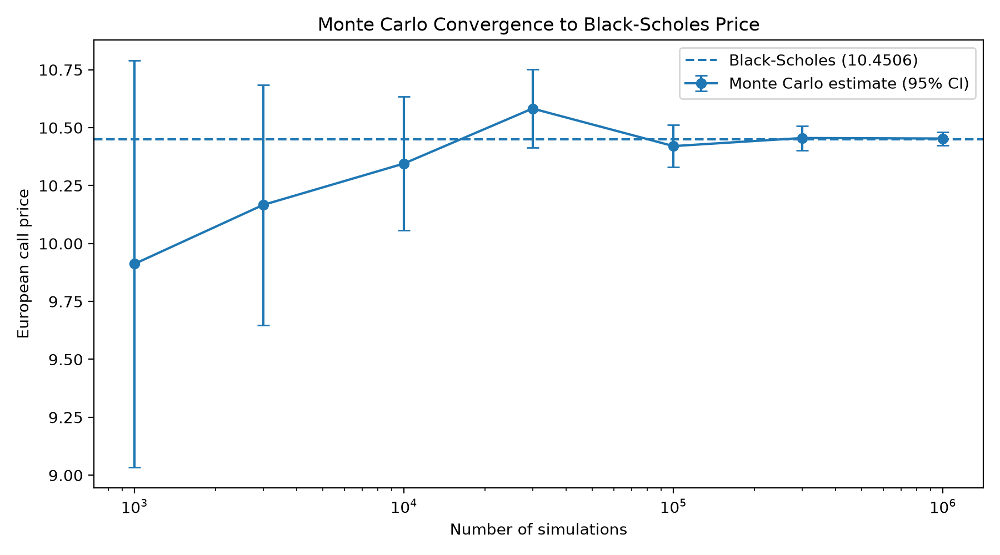
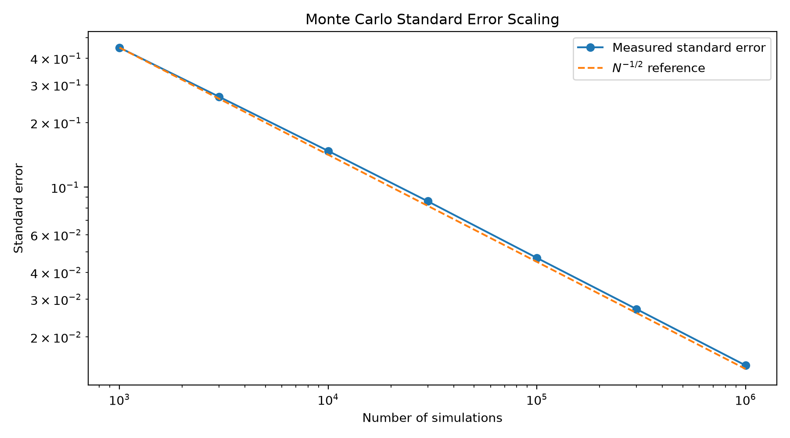
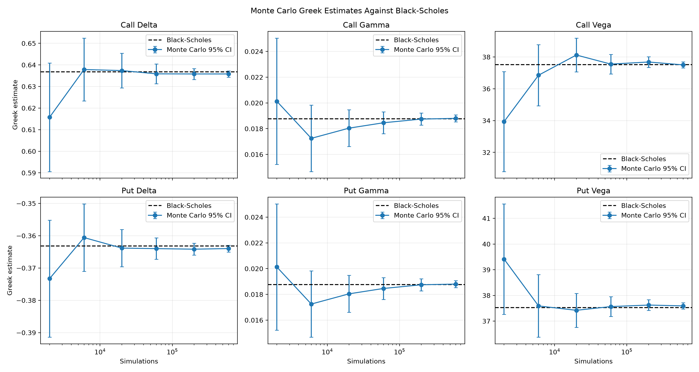
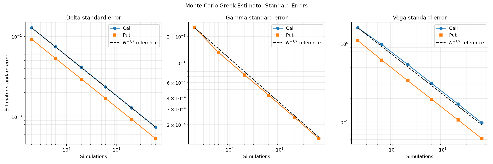
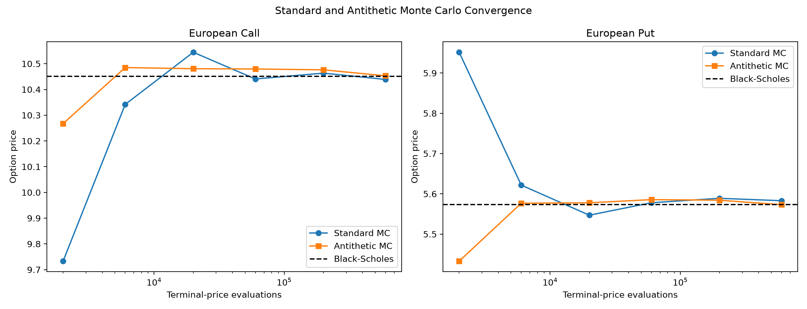
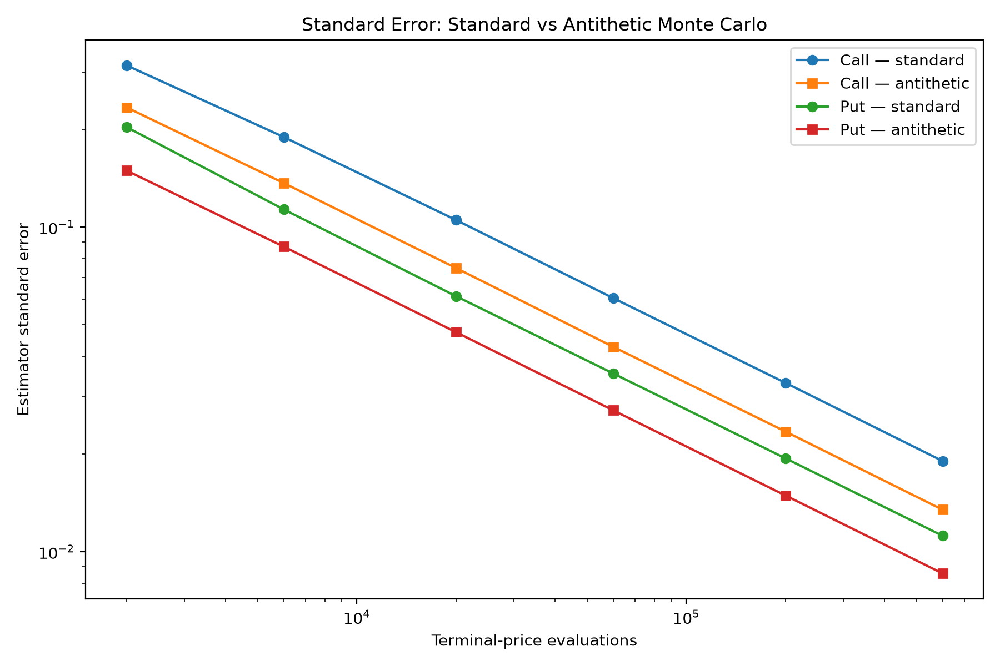

# Monte Carlo Option Pricing & Risk Engine

A numerical finance project exploring derivative pricing through Monte Carlo simulation, analytical benchmarking, sensitivity analysis, variance reduction, and statistical convergence.

Built as part of my exploration of **quantitative finance, numerical methods, and scientific computing** as a Theoretical Physics student at the University of Bath.

## Overview

This project implements a Monte Carlo framework for pricing European call and put options under geometric Brownian motion.

Rather than treating Monte Carlo pricing as a black box, the implementation is validated against the analytical Black–Scholes solution and used to investigate estimator uncertainty, convergence, option sensitivities, and antithetic variance reduction.

The current version includes:

- Black–Scholes analytical pricing for European calls and puts
- Risk-neutral geometric Brownian motion simulation
- Standard Monte Carlo call and put pricing
- Antithetic Monte Carlo call and put pricing
- Standard-error estimation and 95% confidence intervals
- Analytical validation against Black–Scholes
- Analytical Delta, Gamma, Vega, Theta, and Rho
- Finite-difference validation of every Greek
- Pathwise Monte Carlo estimators for Delta and Vega
- Common-random-number finite-difference Monte Carlo Gamma
- Monte Carlo Greek standard errors and 95% confidence intervals
- Analytical and Monte Carlo put-call parity tests
- Monte Carlo convergence analysis
- Unified analytical, standard Monte Carlo, and antithetic comparison engine
- Reproducible CSV export of Greek convergence results
- Empirical verification of the expected $N^{-1/2}$ standard-error scaling
- Automated tests and code-quality checks

## Mathematical Model

Under the risk-neutral measure, the underlying asset follows geometric Brownian motion:

$$
dS_t = rS_t\,dt + \sigma S_t\,dW_t.
$$

The terminal asset price therefore has the exact solution

$$
S_T =
S_0
\exp\left[
\left(r-\frac{\sigma^2}{2}\right)T
+
\sigma\sqrt{T}Z
\right],
\qquad Z\sim\mathcal{N}(0,1).
$$

For European call and put options with strike $K$, the terminal payoffs are

$$
\max(S_T-K,0)
\qquad\text{and}\qquad
\max(K-S_T,0),
$$

respectively. The standard Monte Carlo call estimator is

$$
\hat C =
e^{-rT}
\frac{1}{N}
\sum_{i=1}^{N}
\max(S_T^{(i)}-K,0),
$$

with the put estimator defined analogously using the put payoff.

## Validation Against Black–Scholes

For the benchmark parameters:

| Parameter | Value |
| --- | ---: |
| Spot price | 100 |
| Strike | 100 |
| Risk-free rate | 5% |
| Volatility | 20% |
| Maturity | 1 year |
| Simulations | 1,000,000 |

the call-pricing implementation produces approximately:

```text
Black-Scholes:   10.4506
Monte Carlo:     10.4532
Absolute error:   0.0026
```

The Monte Carlo estimator produced a standard error of approximately `0.0147`, with the analytical Black–Scholes value lying within its 95% confidence interval.

The test suite performs the same analytical confidence-interval validation for both calls and puts. It also verifies put-call parity,

$$
C-P=S_0-Ke^{-rT},
$$

for the analytical, standard Monte Carlo, and antithetic Monte Carlo implementations.

## Convergence Analysis

### Convergence towards the analytical solution



As the number of simulations increases, the Monte Carlo estimate becomes increasingly concentrated around the analytical Black–Scholes price.

### Standard-error scaling



For ordinary Monte Carlo simulation, statistical error is expected to scale as

$$
O(N^{-1/2}).
$$

The numerical experiment compares the measured standard error against an $N^{-1/2}$ reference curve, demonstrating the expected convergence behaviour.

## Analytical Greeks

The project implements analytical Black–Scholes sensitivities for European call and put options:

- Delta
- Gamma
- Vega
- Theta
- Rho

Each Greek is tested against a known benchmark value and independently validated using a central finite-difference approximation of the existing Black–Scholes pricing functions.

Sensitivity conventions:

- Theta is reported per year using the calendar-time convention.
- Vega is reported per unit change in volatility.
- Rho is reported per unit change in the continuously compounded risk-free rate.

## Monte Carlo Greeks

The project also estimates Delta, Gamma, and Vega from simulated terminal prices and compares each estimator with its analytical Black–Scholes benchmark.

### Pathwise Delta

Because the GBM terminal price is proportional to the initial spot,

$$
\frac{\partial S_T}{\partial S_0}=\frac{S_T}{S_0}.
$$

The pathwise call Delta estimator is therefore

$$ \widehat{\Delta}_{\mathrm{call}} = \frac{e^{-rT}}{N} \sum_{i=1}^{N} \mathbf{1}_{\{S_T^{(i)}>K\}} \frac{S_T^{(i)}}{S_0}, $$

with the corresponding put estimator using
$-\mathbf{1}_{\{S_T^{(i)}<K\}}$.

### Pathwise Vega

Differentiating the exact GBM solution with respect to volatility gives

$$ \frac{\partial S_T}{\partial \sigma} = S_T\left(\sqrt{T}Z-\sigma T\right). $$

Combining this terminal-price sensitivity with the derivative of the call or put payoff produces a direct pathwise Vega estimator.

### Finite-difference Gamma

The European option payoff is not differentiable at the strike, so Gamma is estimated using a central finite difference:

$$ \widehat{\Gamma} = \frac{ \widehat{V}(S_0+h) -2\widehat{V}(S_0) +\widehat{V}(S_0-h)}{h^2}. $$

All three valuations use common random numbers. Reusing the same Gaussian draws isolates the effect of the spot perturbation and substantially reduces the noise that would arise from independent simulations.

Each Monte Carlo Greek result includes the estimate, estimator standard error, and a 95% confidence interval.

### Greek convergence



Across simulation budgets from 2,000 to 600,000 paths, the call and put Delta, Gamma, and Vega estimates converge towards their analytical Black–Scholes values. The confidence intervals narrow as the simulation budget increases, and every analytical benchmark lies inside the corresponding 95% confidence interval at 600,000 simulations.

### Greek estimator standard errors



The measured standard errors closely track the theoretical $N^{-1/2}$ reference slope. Increasing the simulation count from 2,000 to 600,000 multiplies the sample size by 300, predicting an error reduction of $\sqrt{300}\approx17.32$.

The observed reductions include:

| Estimator | SE at 2,000 | SE at 600,000 | Reduction factor |
| --- | ---: | ---: | ---: |
| Call Delta | 0.012819 | 0.000744 | 17.23× |
| Gamma | 0.002504 | 0.000139 | 18.01× |
| Call Vega | 1.600593 | 0.097863 | 16.36× |

The complete experiment output is stored in [`docs/data/monte_carlo_greeks_convergence.csv`](docs/data/monte_carlo_greeks_convergence.csv), allowing the figures and numerical claims to be reproduced directly from the recorded results.

## Antithetic Variance Reduction

The antithetic estimator draws $Z\sim\mathcal{N}(0,1)$ and pairs each draw with $-Z$. This produces the terminal-price pair

$$
S_T^{(+)} =
S_0e^{(r-\frac12\sigma^2)T+\sigma\sqrt{T}Z},
\qquad
S_T^{(-)} =
S_0e^{(r-\frac12\sigma^2)T-\sigma\sqrt{T}Z}.
$$

For a call, each independent estimator observation is the paired payoff average

$$
Y_i = \frac{1}{2}
\left[
\max(S_{T,i}^{(+)}-K,0)
+
\max(S_{T,i}^{(-)}-K,0)
\right].
$$

The put estimator uses the corresponding put payoffs. Confidence intervals and standard errors are calculated from the independent pair averages rather than incorrectly treating the two correlated payoffs in each pair as independent observations.

The tests compare standard and antithetic estimators using equal numbers of terminal-price evaluations and verify that the antithetic estimator reduces the standard error for the benchmark call and put options.

## Unified Option Comparison

The comparison engine evaluates one immutable set of European option parameters across:

- analytical Black–Scholes call and put pricing;
- standard Monte Carlo pricing;
- antithetic Monte Carlo pricing;
- absolute pricing errors;
- estimator standard errors and confidence intervals;
- standard-error and variance-reduction factors;
- analytical call and put Greeks;
- Monte Carlo Delta, Gamma, and Vega estimates;
- Greek estimation errors, standard errors, and confidence-interval coverage.

Standard and antithetic estimators are compared using equal terminal-price evaluation budgets. If the standard estimator uses $N$ simulated prices, the antithetic estimator uses $N/2$ pairs and therefore evaluates the same total number of terminal prices.

### Price convergence



Both estimators converge towards the analytical Black–Scholes prices. The antithetic estimates fluctuate less around the analytical benchmark, particularly at smaller simulation budgets.

### Standard-error comparison



At an equal budget of 600,000 terminal-price evaluations, the benchmark experiment produced:

| Option | Standard SE | Antithetic SE | SE reduction | Variance reduction |
| --- | ---: | ---: | ---: | ---: |
| Call | 0.019017 | 0.013460 | 1.413× | 1.996× |
| Put | 0.011188 | 0.008564 | 1.306× | 1.707× |

For the benchmark call, antithetic sampling approximately halved the estimator variance. For the benchmark put, it reduced the estimator variance by approximately 41%. Across the tested budgets, both standard and antithetic standard errors retain the expected $N^{-1/2}$ scaling.

## Project Structure

```text
.
├── .github/
│   └── workflows/
│       └── ci.yml
├── docs/
│   ├── data/
│   │   └── monte_carlo_greeks_convergence.csv
│   └── figures/
│       ├── monte_carlo_convergence.png
│       ├── monte_carlo_greeks_convergence.png
│       ├── monte_carlo_greeks_standard_error.png
│       ├── standard_error_scaling.png
│       ├── variance_reduction_convergence.png
│       └── variance_reduction_standard_error.png
├── examples/
│   ├── convergence_analysis.py
│   ├── error_scaling.py
│   ├── greeks_convergence_analysis.py
│   ├── option_comparison.py
│   └── variance_reduction_analysis.py
├── src/
│   └── quantmc/
│       ├── __init__.py
│       ├── analysis/
│       │   ├── __init__.py
│       │   └── option_comparison.py
│       ├── models/
│       │   ├── __init__.py
│       │   └── geometric_brownian_motion.py
│       ├── pricing/
│       │   ├── __init__.py
│       │   ├── black_scholes.py
│       │   ├── greeks.py
│       │   ├── monte_carlo.py
│       │   └── monte_carlo_greeks.py
│       └── risk/
│           └── __init__.py
├── tests/
│   ├── test_black_scholes.py
│   ├── test_geometric_brownian_motion.py
│   ├── test_greeks.py
│   ├── test_monte_carlo.py
│   ├── test_monte_carlo_greeks.py
│   └── test_option_comparison.py
├── .gitignore
├── LICENSE
├── pyproject.toml
└── README.md
```

## Installation

Clone the repository and create an isolated Python environment:

```bash
git clone git@github.com:pestopasta74/monte-carlo-risk-engine.git
cd monte-carlo-risk-engine

python3 -m venv .venv
source .venv/bin/activate

python -m pip install -e ".[dev]"
```

## Running the Analysis

Run the test suite:

```bash
pytest -v
```

Check code quality:

```bash
ruff check .
```

Generate the convergence figures:

```bash
python examples/convergence_analysis.py
python examples/error_scaling.py
```

Run the unified benchmark comparison:

```bash
python examples/option_comparison.py
```

Generate the standard-versus-antithetic comparison figures:

```bash
python examples/variance_reduction_analysis.py
```

Generate the Monte Carlo Greek convergence figures and CSV data:

```bash
python examples/greeks_convergence_analysis.py
```

## Roadmap

Future development will explore:

- Greek profiles across spot price, volatility, and maturity
- Antithetic variance reduction for Monte Carlo Greek estimators
- A reproducible technical paper describing the methods and results
- Value at Risk and Expected Shortfall
- Historical-data experiments and model backtesting
- Additional stochastic models
- Performance comparisons between numerical approaches

## Motivation

My background in theoretical physics has made numerical simulation, probability, and mathematical modelling particularly interesting to me.

This project is an opportunity to apply those ideas to quantitative finance while developing a better understanding of both the underlying mathematics and the engineering required to build reliable numerical software.

## Author

**Preston Whiteman**  
Theoretical Physics — University of Bath

[LinkedIn](https://www.linkedin.com/in/pestopasta74/) · [GitHub](https://github.com/pestopasta74)
